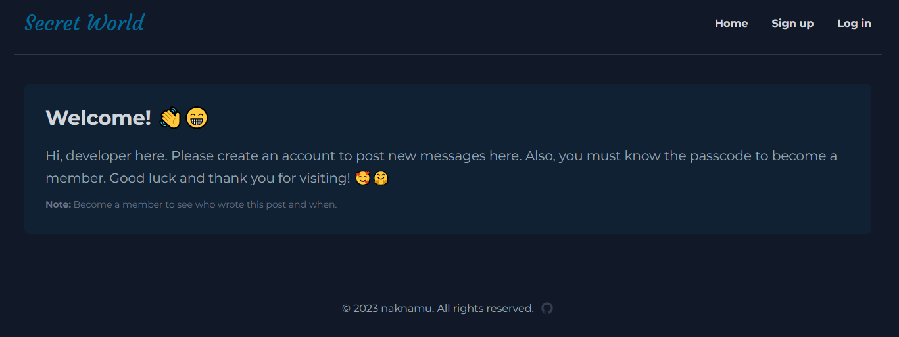

# Secret World

An exclusive clubhouse where members can write anonymous posts.

<figure>
    
    <figcaption>A preview of the home page in desktop.</figcaption>
</figure>

## Live Demo
Check the live demo [here.](https://secret-world-production.up.railway.app/)

## Passcode 
*(needed to become a member)*  
<mark style="background-color: gray">SAKALAM</mark>

## Features
- Beautiful, clean and dark-themed UI interface.
- Responsive design that works well in mobile, tablet and large screen devices.
- User's passwords are secured and encrypted by a hashing algorithm.
- Create and post messages online

## Technologies Used
- [NodeJS](https://nodejs.org/en)
- [ExpressJS](https://expressjs.com/)
- [MongoDB](https://www.mongodb.com/)
- [EJS](https://ejs.co/)
- [PassportJS](https://www.passportjs.org/)
- [bcryptJS](https://www.npmjs.com/package/bcryptjs)
- [MongooseJS](https://mongoosejs.com/)
- [Luxon](https://www.npmjs.com/package/luxon)

## License

